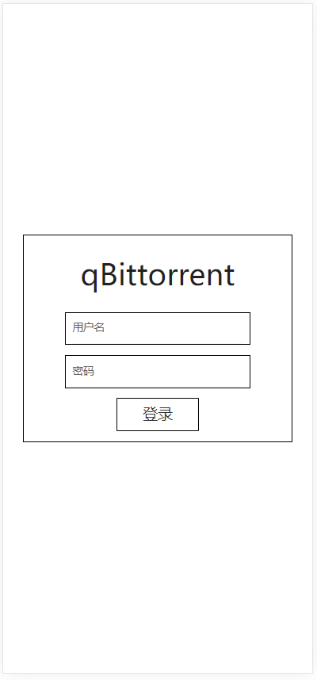
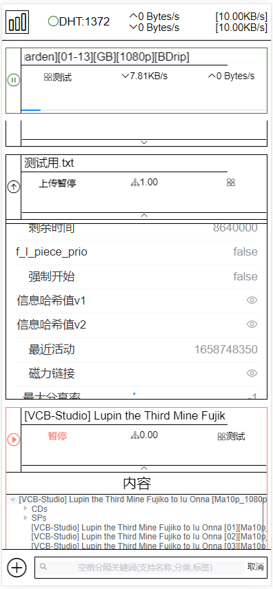
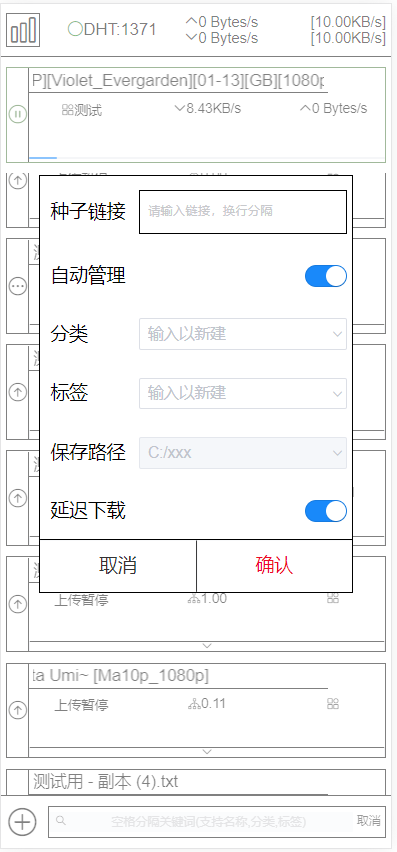
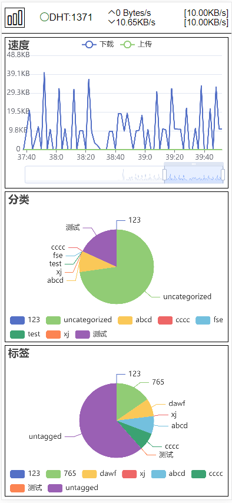

# qBittorrent Web UI 移动版

## 开发调试

```javascript
yarn serve
```


## 上线示例 [qBittorrent](https://qb.xiezi08.ink/).

由于安全、成本、政策等原因

<font color=red>示例使用国外渣vps反向代理连接，请通过IPv6访问，访问较慢，偶尔掉线，出现问题请尝试刷新</font>

无法连接时可见下方预览，基本展示了所有功能，见谅

账号:guest
密码:testqbwebui

## [旧版桌面端](https://github.com/blytzxdl/qbwebui/tree/desktop)


## 更新计划

- 响应式，渐进增强
- 优化数据结构和数据管理，减少网络和性能开销
- 美化UI，主题切换
- 待完成新功能(不分先后)：
  - 速度限制切换
  - 下载内容管理
  - 通过种子文件添加下载
  - 本地存储个人配置项
  - ...

## 当前版本界面预览


<br/>



