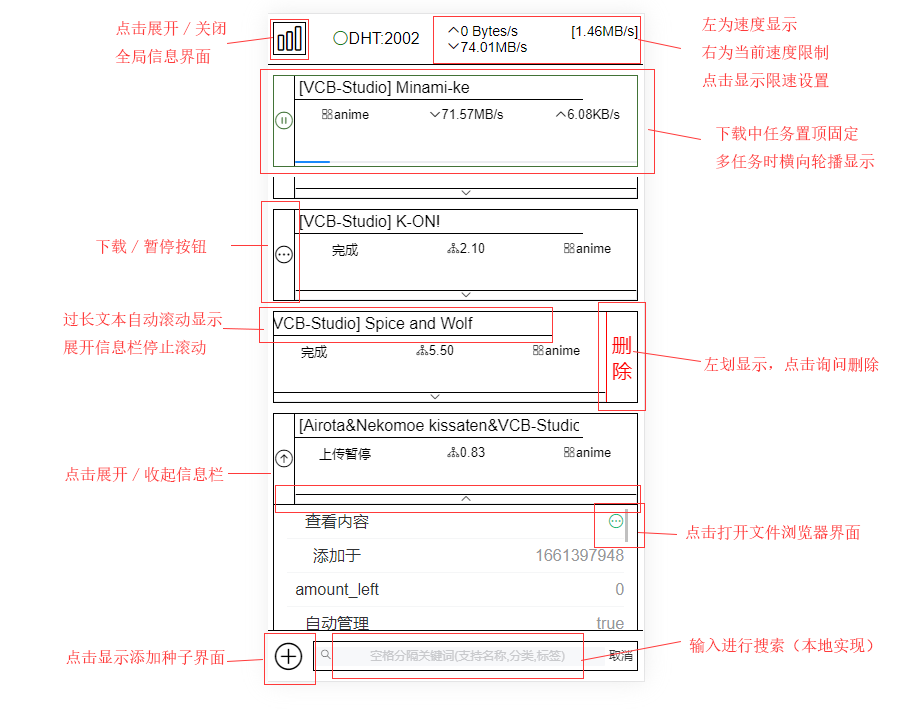
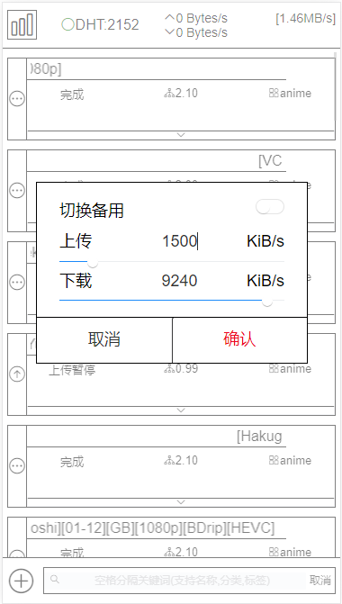
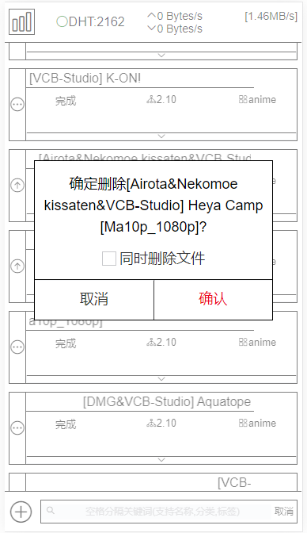
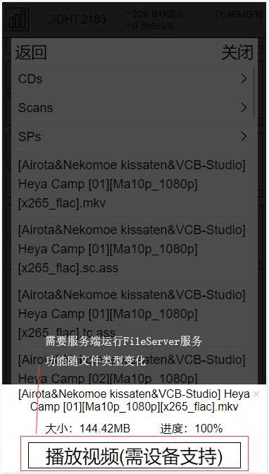
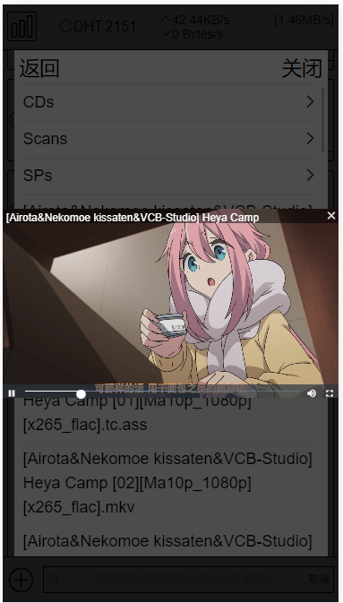

# qBittorrent Web UI 移动版

## 使用方法

```javascript
yarn serve//调试
yarn build//编译，编译完的文件放到qBittorrent下/dist/public文件夹内（没有则新建）
```


## 上线示例 [qBittorrent](https://qb.xiezi08.ink/).

更换方案中，暂时下线


## 配套文件服务器[File-server-for-qBittorrent](https://github.com/blytzxdl/File-server-for-qBittorrent)

windows端服务，配置后可为webUI提供文件内容服务，重点支持视频播放（可转码、烧录字幕）


## [旧版桌面端](https://github.com/blytzxdl/qbwebui/tree/desktop)


## 主要功能及预览

- 登录界面

  

- 主界面

  

- 全局信息界面

  

- 限速设置弹窗

  

- 添加种子弹窗（自动管理时无法设置保存路径）

  

- 删除弹窗

  

- 文件浏览器（未配置FileServer时仅提供内容目录、文件信息查看）

  

- 视频播放器（进度条在服务端视频文件处理完成后显示）

  


## 更新计划

- 美化UI，主题切换（更新完UI就release）
- 待完成新功能(不分先后)：
  - 文件内容管理
  - 通过种子文件添加下载
  - 本地存储个人配置项
  - ...

