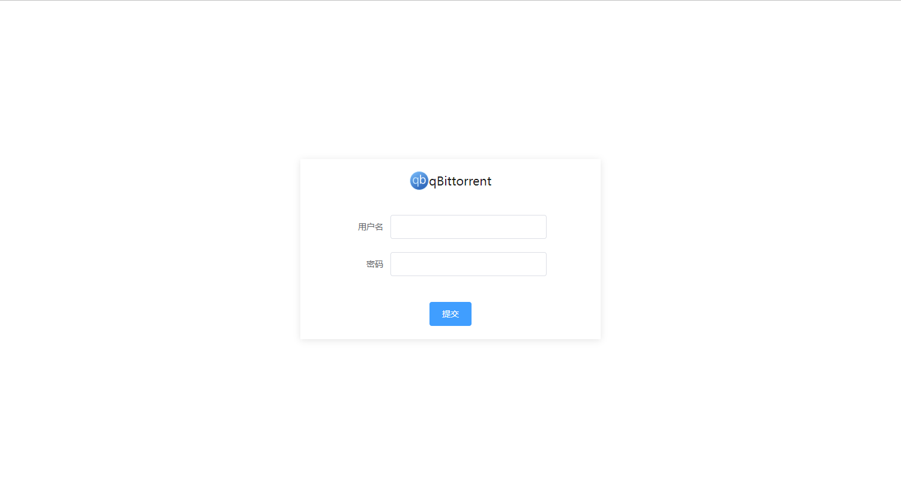
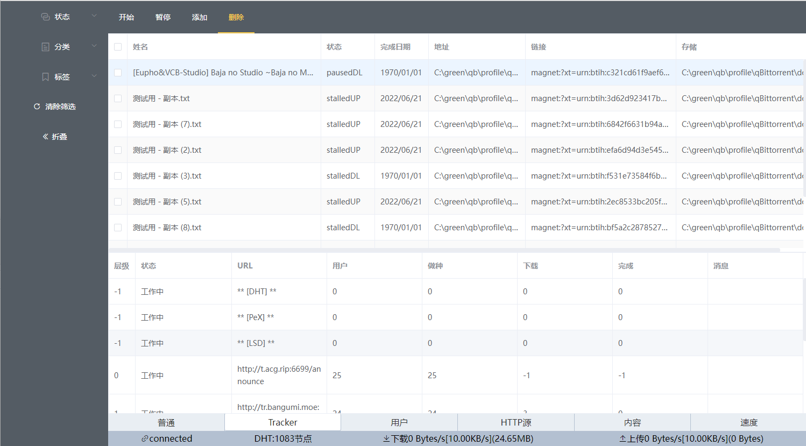
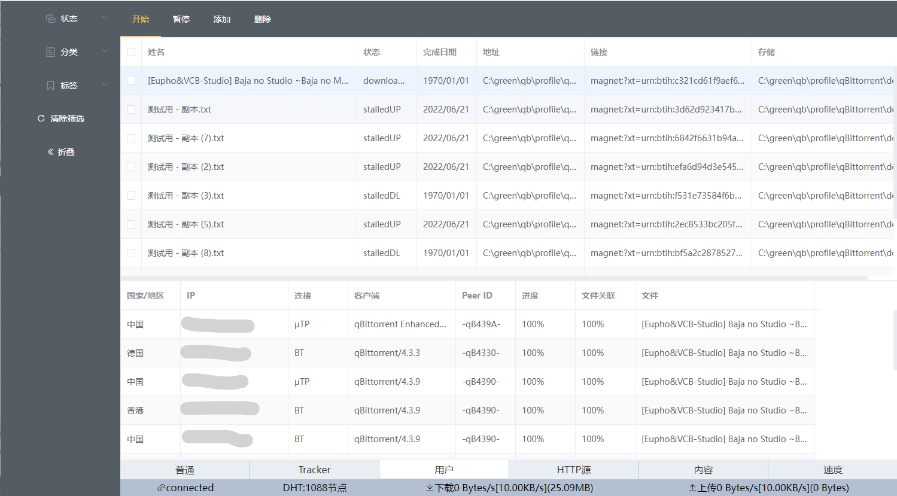
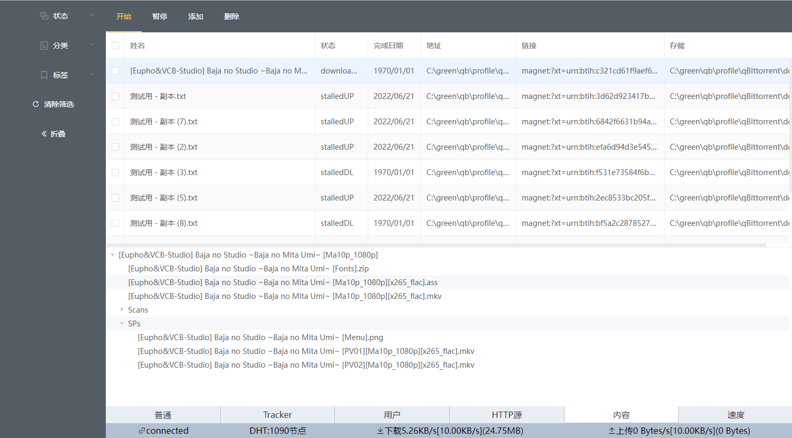
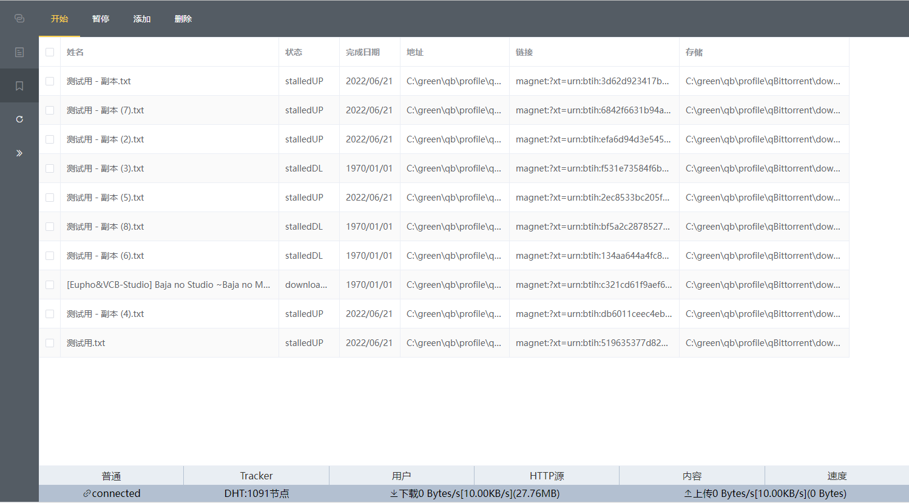
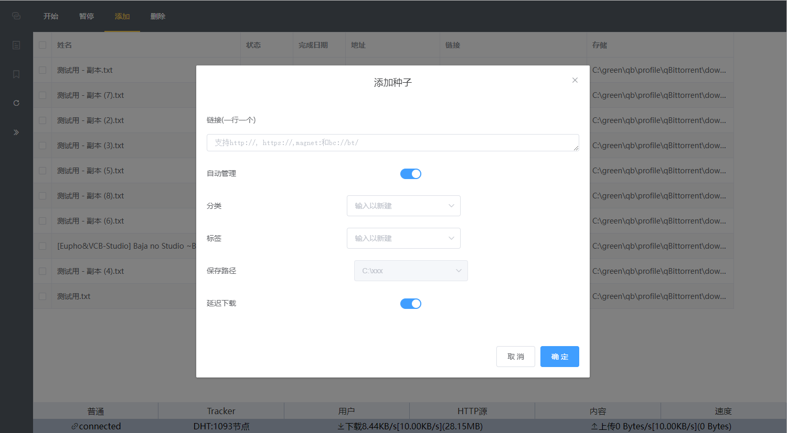
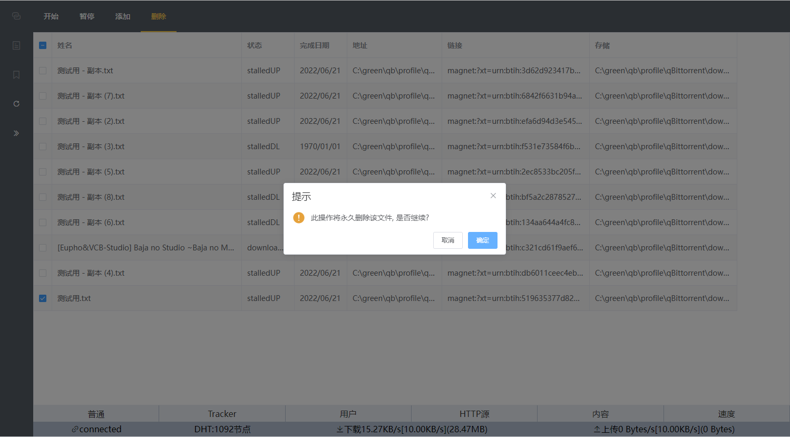

# qBittorrent Web UI

## 开发调试

```
yarn serve
```

## 上线示例 [qBittorrent](https://qb.xiezi08.ink/).

由于安全、成本、政策等原因

<font color=red>示例使用国外渣vps反向代理连接，请尽量使用IPv6访问，访问较慢，偶尔掉线，出现问题请尝试刷新</font>

目前每天都会检查，无法连接时可见下方预览，基本展示了所有功能，见谅

账号:guest

密码:testqbwebui

## dev分支[移动端](https://github.com/blytzxdl/qbwebui/tree/dev)开发中

## 当前版本界面预览















