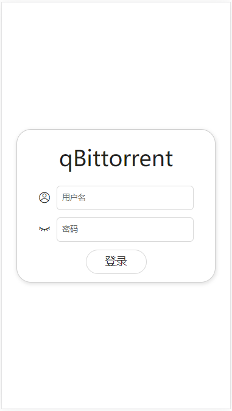
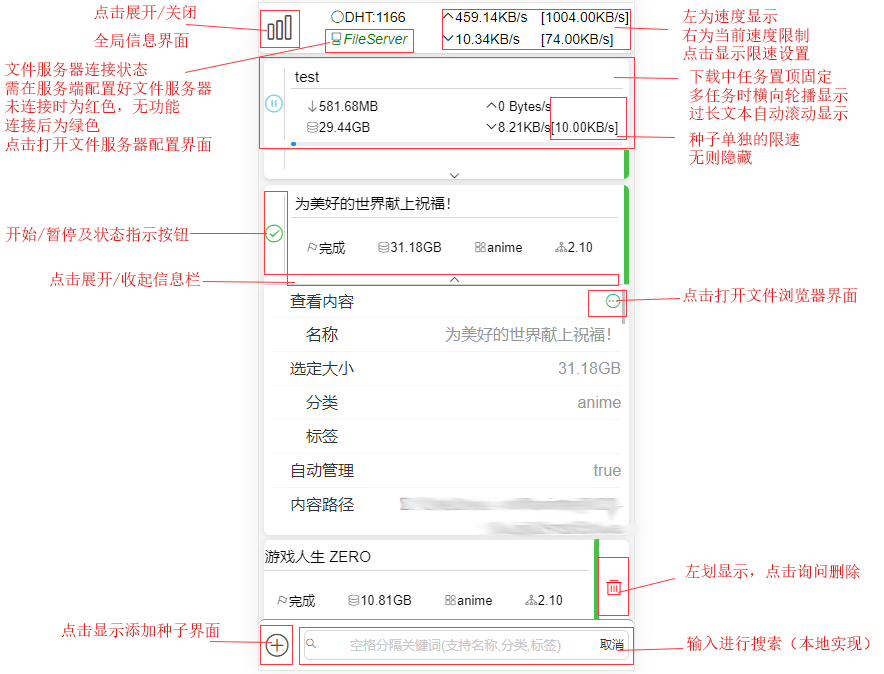
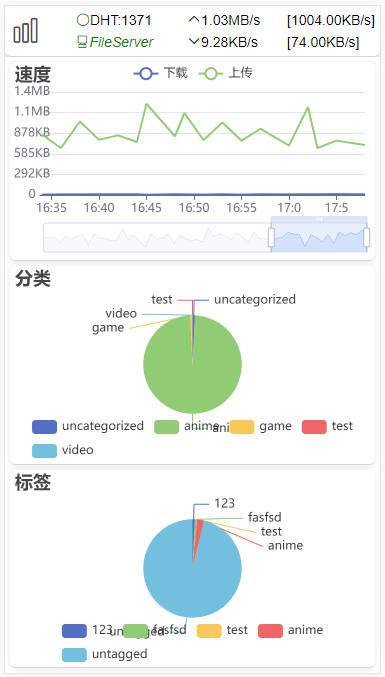
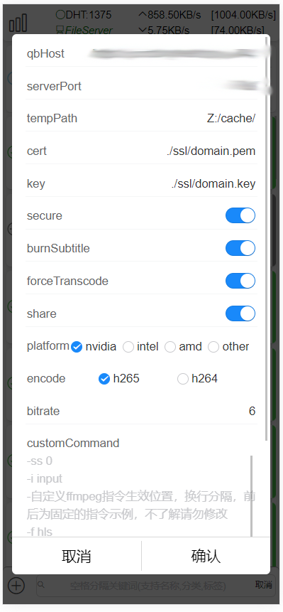
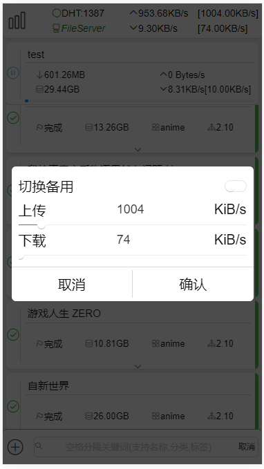
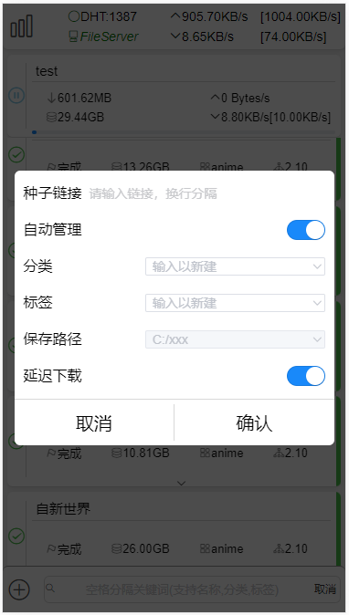
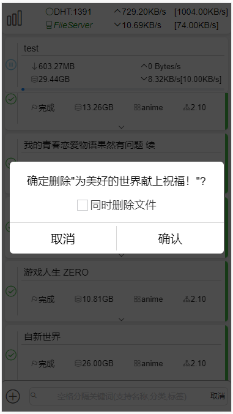
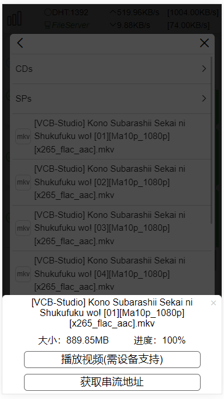

# qBittorrent Web UI 移动版

## 使用方法

---

将release的压缩包解压到qBittorrent的根目录，在qBittorrent中设置开启备用web UI，文件位置为dist文件夹所在路径，即最后路径为X:\\...\qBittorrent\dist


## 编译

---

```javascript
yarn serve//调试
yarn build//编译
```


## 配套文件服务器[FileServer-for-qBittorrent](https://github.com/blytzxdl/FileServer-for-qBittorrent)

windows端服务（后续可能支持linux、openwrt等），配置后可为webUI提供文件内容服务，重点支持视频播放（可转码串流、烧录字幕）


## 主要功能及预览

- 登录界面

  

- 主界面

  

- 全局信息界面

  

- 文件服务器配置弹窗（具体配置说明请看[FileServer-for-qBittorrent](https://github.com/blytzxdl/FileServer-for-qBittorrent)）

  

- 限速设置弹窗

  

- 添加种子弹窗（自动管理时无法设置保存路径）

  

- 删除弹窗

  

- 文件浏览器（未配置FileServer时仅提供内容目录、文件信息查看）

  

- 视频播放器（进度条在服务端视频文件处理完成后显示）

  ！！！播放能力受平台（如ios对h265支持更好，安卓、pc在网页上大概率不支持h265）、浏览器（如alook可接管视频播放来支持h265，via，chrome等无此功能）等因素限制，如播放错误，请尝试修改文件服务器转码配置

  


## 更新计划（不分先后）

- 通过种子文件添加下载
- 基础刮削（重命名、海报图）
- 增加种子可操作功能
- 增强文件浏览器
- 增加ui动画
- ...

### [旧版桌面端](https://github.com/blytzxdl/qbwebui/tree/desktop)

---

